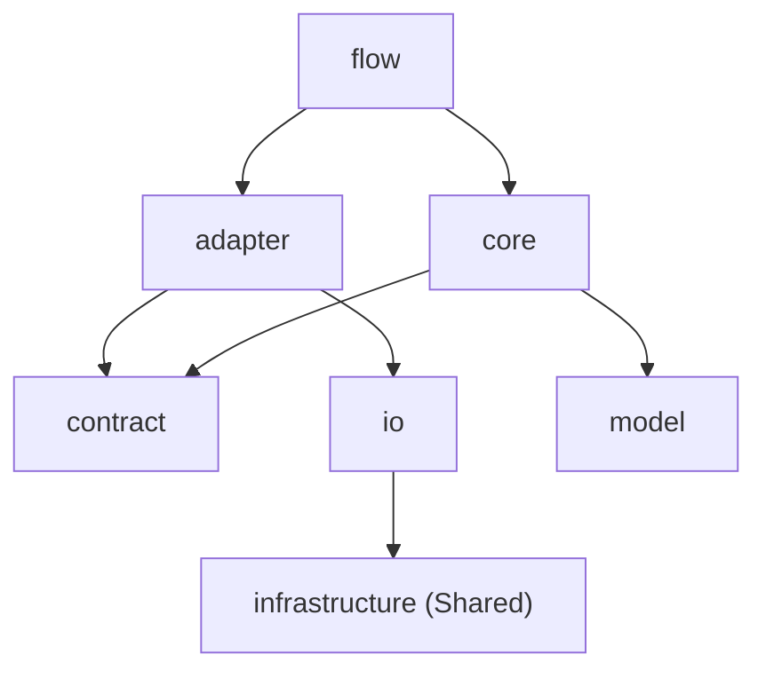

# アーキテクチャ概要（Architecture Overview）

本ドキュメントは、FUL プロジェクトの高レベルなアーキテクチャ方針と設計原則を定義します。
詳細なディレクトリ構造や実装ガイドラインについては、以下のドキュメントを参照してください。

- **[Unified Structure Guide](design/unified-structure-guide.md)**: パッケージ構成と命名規則の詳細
- **[Pipeline Architecture](design/pipeline_design_spec.md)**: パイプライン処理の流れと各フェーズの詳細
- **[i18n Design Specification](design/i18n_design_spec.md)**: メッセージキー設計と国際化実装ルール
- **[AST Overview](ast-overview.md)**: 抽象構文木の基本と FUL 内での利用箇所

---

## 1. 設計原則（Design Principles）

### 1.1 単一責任原則（Single Responsibility Principle）
- クラス・モジュールは **1つの責務（1つの変更理由）** のみを持つ。
- 複数の理由で変更される処理は、別クラス・別モジュールに分割する。
- 「大きくて便利なクラス」よりも「小さく明確なクラス」を優先する。

### 1.2 Plugin-centric Package by Layer
- 機能（フェーズ）ごとに `plugins/*` 配下へパッケージを切り、その内部でレイヤー化する構成を採用する。
- **Plugins**: `plugins/analysis`, `plugins/reporting`, `plugins/document`, `plugins/exploration`, `plugins/junit`, `plugins/noop`
- **Layer**: `flow`, `contract`, `model`, `core`, `adapter`, `io`（必要に応じて一部レイヤーを省略する。例: `plugins/exploration` は `stage/flow/core` のみ）
- **Core 下位構成の統一**: `core` は `context`, `model`, `rules`, `service`, `util` を基本とし、必要に応じて `scoring` や `service/<domain>` のサブパッケージを追加する。フェーズ固有の主要ロジックは `core/service` に集約する。

プラグインの詳細は **[Plugin Architecture](plugins/architecture.md)** を参照してください。

### 1.3 依存性の方向（Dependency Direction）
- 依存関係は常に **安定した方向（詳細から抽象へ、外側から内側へ）** に向くように統制する。
- 外部ライブラリや I/O の詳細は `io` に閉じ込め、ビジネスロジック `core` はこれらに依存しない。
- `plugins/*` は `kernel/pipeline` の `Stage`/`RunContext` に依存し、`kernel/pipeline` は `plugins/*` を参照しない。配線は `ui`（CLI/TUI）側で行う。

---

## 2. パッケージ構成（Package Structure）

プロジェクト全体は、オーケストレーション層の `kernel`、共有技術基盤 `infrastructure`、機能実装 `plugins`、ユーザーインターフェース `ui` に大別されます。設定クラスは `config` パッケージに配置されます。`feature` と `plugins/bundled` は廃止され、すべての機能は `plugins/*` に統合されます。

```
com.craftsmanbro.fulcraft
├── config                   # 設定・検証・オーバーライド
├── kernel                   # プラットフォーム基盤 (Pipeline, PluginManager 等)
│   ├── pipeline
│   ├── plugin
│   └── workflow
├── infrastructure           # 共通技術基盤
├── plugins                  # すべての機能は並列なプラグイン
│   ├── analysis             # 静的解析 (旧 feature/analysis)
│   ├── reporting            # レポート機能 (旧 feature/reporting)
│   ├── document             # ドキュメント生成 (旧 feature/document)
│   ├── exploration          # 探索 (旧 feature/exploration)
│   ├── junit                # JUnit スイート
│   └── noop                 # ダミー
└── ui                       # CLI / TUI
```

> **Note**: CLI の DI/配線は `ui/cli/wiring` に集約し、`kernel/pipeline` は実行制御と共通モデルに専念する。

> **Note**: `infrastructure` パッケージは共有技術基盤であり、各機能フェーズの `adapter` レイヤーを経由して利用されます。`flow` や `core` から直接参照してはいけません。

---

## 3. レイヤーの責務と役割

各機能プラグイン（Plugin Package）は、以下の標準レイヤーで構成されます。

### 3.1 flow
- **役割**: フェーズの **Orchestrator（指揮者）**。
- **責務**:
  - フェーズのエントリーポイント (`execute` / `selectTargets` など)。
  - 必要な `adapter` を組み立てるか、外部から渡された依存を受け取って `core` に委譲する。
  - `RunContext`/`Config` などの入力を整形して `core` に渡す。
  - ビジネスロジックは持たない。

### 3.2 contract
- **役割**: 機能の **Interface（境界）**。
- **責務**:
  - 外部に公開するインターフェース (`Port`) や、入出力データ型 (`Request`/`Response`) を定義する。
  - 実装の詳細を隠蔽するための抽象化層。
  - `core` が必要とする「機能」を定義する（誰がどう実現するかは関知しない）。

### 3.3 model
- **役割**: **Domain Model（データ構造）**。
- **責務**:
  - フェーズ内部で使用するドメインモデルや値オブジェクト (Value Object)。
  - `core` ロジックが操作する対象。

### 3.4 core
- **役割**: **Business Logic（頭脳）**。
- **責務**:
  - 純粋なビジネスロジック、ルール、計算処理。
  - 外部 I/O やフレームワークに依存せず、POJO で実装される。
  - `contract` で定義されたインターフェースを通して外部リソースを利用する。

### 3.5 adapter
- **役割**: **Translation（通訳）**。
- **責務**:
  - `contract` で定義されたインターフェース (`Port`) を実装する。
  - `core` からの抽象的な要求を、具体的な `io` の操作に変換（翻訳）して委譲する。
  - `io` から返ってきた詳細なデータを、ドメインモデルに変換して `core` に返す。
  - **原則**: ビジネスロジックを含んではならない。

### 3.6 io
- **役割**: **Data Access & Infrastructure（実働部隊）**。
- **責務**:
  - 具体的なファイル読み書き、外部コマンド実行、APIコールを行う。
  - `infrastructure` パッケージの汎用ツール（JSONパーサ、ProcessBuilder等）を利用する。
  - ユニットテストには実際のファイルシステムや外部環境が必要（Integration Test）。

---

## 4. 依存関係ルール（Dependency Rules）

### 4.1 許可される依存方向



### 4.2 実行時と構築時の違い

1.  **構築時 (Dependency Setup by Flow)**:
    - `PipelineFactory`/`Flow` が `Adapter` を組み立てて `Core` に注入します。
    - そのため構築時は配線層が全レイヤーに触れます。

2.  **実行時 (Runtime Call Chain)**:
    - **Core** → (呼び出し) → **Contract (Interface)**
    - **Adapter** (Contractの実装) → (委譲) → **IO**
    - **IO** → (利用) → **Infrastructure**
    - ※ `Core` は `IO` や `Infrastructure` を直接知りません。

### 4.3 禁止事項
- `core` から `adapter` や `io` への直接依存。
- `adapter` にビジネスロジックを持たせること。
- `io` にドメインロジックを持たせること。

---

## 5. パイプライン制御

FUL はパイプラインアーキテクチャを採用しており、各工程は `Stage` として定義されます。

1. **CLI/Entrypoint**: ユーザー入力を受け取り、`Config` を構築して `PipelineRunner` を起動。
2. **Runner**: `PipelineFactory` を使用してパイプラインを構築・実行。`WorkflowLoader`/`WorkflowPlanResolver` で workflow を解決し、`pipeline.stages`（lowercase のリスト）をノードフィルタとして適用します。
3. **Pipeline**: 登録されたノード `Stage`（`WorkflowNodeStage`）を依存順（DAG）で実行。トップレベルの公式ステップラベルは `analyze` -> `generate` -> `report` -> `document` -> `explore` を維持しつつ、実体は workflow ノードとして登録されます。`select` と `brittle_check` は `generate` の alias として扱われ、対応する workflow ノード（例: `junit-select`, `junit-brittle-check`）で実行されます。
4. **Stage**: 各フェーズの `Flow` を呼び出し、フェーズ間のデータの受け渡し（`RunContext`）を管理。

---

## 6. AI自動生成への指針

AI エージェント等による開発を行う際は、以下の点を遵守してください：

- **レイヤー構造の維持**: 新機能追加時は、既存のレイヤー構造（flow/contract/core/adapter/io）に当てはめて設計する。
- **インターフェースの活用**: 拡張ポイントは `contract` にインターフェースとして定義し、実装を `adapter` や `io` に置く。
- **モデルの分離**: データの受け渡しには Map や Object[] ではなく、明示的なクラス（Record 等）を使用する。
