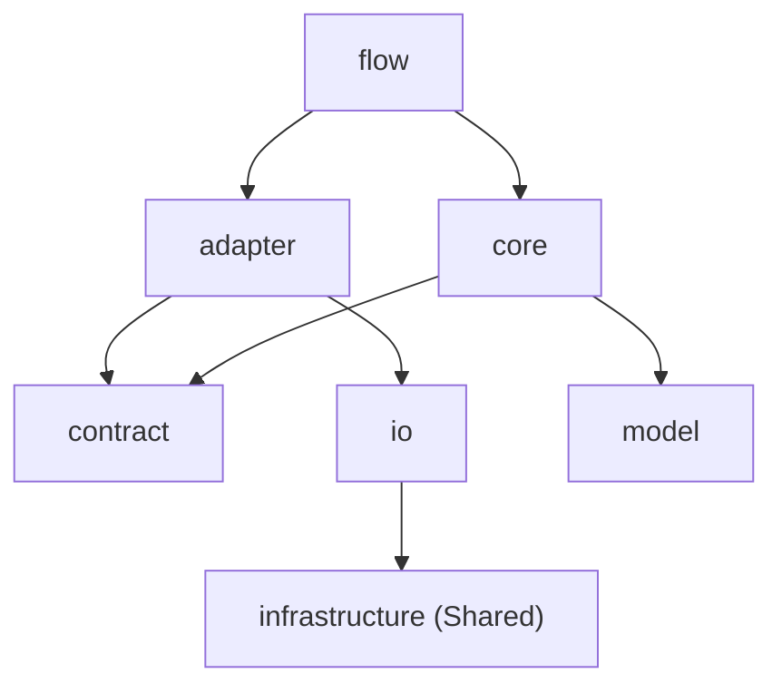

# Architecture Overview

This document defines the high-level architectural direction and design principles for FUL.
For detailed package structure and implementation guidance, see these documents:

- **[Unified Structure Guide](design/unified-structure-guide.md)**: package structure and naming conventions
- **[Pipeline Architecture](design/pipeline_design_spec.md)**: pipeline flow and phase-level details
- **[i18n Design Specification](design/i18n_design_spec.md)**: message-key design and internationalization rules
- **[AST Overview](ast-overview.md)**: AST basics and where FUL uses them

---

## 1. Design Principles

### 1.1 Single Responsibility Principle

- Each class or module should have exactly one responsibility.
- If code changes for multiple reasons, split it into separate classes or modules.
- Prefer small, explicit classes over large convenience classes.

### 1.2 Plugin-Centric Package by Layer

- FUL organizes functionality under `plugins/*` by phase, then layers each plugin internally.
- **Plugins**: `plugins/analysis`, `plugins/reporting`, `plugins/document`, `plugins/exploration`, `plugins/junit`, `plugins/noop`
- **Layers**: `flow`, `contract`, `model`, `core`, `adapter`, `io`
- **Core substructure**: use `context`, `model`, `rules`, `service`, and `util` as the default shape, with additional subpackages only when justified.

See **[Plugin Architecture](plugins/architecture.md)** for plugin-specific details.

### 1.3 Dependency Direction

- Dependencies should always point in the stable direction: from detail to abstraction and from outer layers to inner layers.
- Hide external libraries and I/O details inside `io`; business logic in `core` should not depend on them directly.
- `plugins/*` may depend on `kernel/pipeline` abstractions such as `Stage` and `RunContext`, but `kernel/pipeline` must not reference `plugins/*` directly.

---

## 2. Package Structure

The project is organized around four main areas: `kernel` for orchestration, `infrastructure` for shared technical building blocks, `plugins` for feature implementations, and `ui` for user-facing interfaces. Configuration classes live under `config`.

```text
com.craftsmanbro.fulcraft
├── config
├── kernel
│   ├── pipeline
│   ├── plugin
│   └── workflow
├── infrastructure
├── plugins
│   ├── analysis
│   ├── reporting
│   ├── document
│   ├── exploration
│   ├── junit
│   └── noop
└── ui
```

Notes:

- CLI dependency wiring is centralized in `ui/cli/wiring`.
- `kernel/pipeline` focuses on execution control and shared models.
- Shared infrastructure should be reached through plugin adapters rather than directly from `flow` or `core`.

---

## 3. Layer Responsibilities

### 3.1 `flow`

- Acts as the phase orchestrator.
- Owns entry points such as `execute` or `selectTargets`.
- Shapes inputs such as `RunContext` and `Config` before delegating to `core`.
- Should not contain business logic.

### 3.2 `contract`

- Defines boundaries and public interfaces.
- Declares ports plus request and response types.
- Lets `core` depend on capabilities without depending on concrete implementations.

### 3.3 `model`

- Holds domain models and value objects used inside a phase.
- Represents the data that core logic operates on.

### 3.4 `core`

- Contains pure business logic, rules, and calculations.
- Avoids direct dependence on frameworks and external I/O.
- Reaches external capabilities only through `contract` interfaces.

### 3.5 `adapter`

- Implements ports defined in `contract`.
- Translates abstract requests from `core` into concrete `io` operations.
- Converts detailed I/O results back into domain models.
- Should not contain business logic.

### 3.6 `io`

- Performs concrete file access, command execution, and API calls.
- Uses shared helpers from `infrastructure` such as JSON parsers or process execution utilities.
- Typically requires integration-style tests because it touches real environments.

---

## 4. Dependency Rules

### 4.1 Allowed Directions



### 4.2 Build-Time vs Runtime

1. **Build time**:
   - `PipelineFactory` and phase `Flow` classes assemble adapters and inject them into `Core`.
2. **Runtime**:
   - `Core` calls `Contract` interfaces.
   - `Adapter` implements those interfaces and delegates to `IO`.
   - `IO` uses `Infrastructure`.
   - `Core` does not know about `IO` or `Infrastructure` directly.

### 4.3 Prohibited Dependencies

- `core` must not depend directly on `adapter` or `io`.
- `adapter` must not contain business logic.
- `io` must not contain domain logic.

---

## 5. Pipeline Control

FUL uses a pipeline architecture in which each unit of work is represented as a `Stage`.

1. **CLI / Entrypoint**: collects user input, builds `Config`, and launches `PipelineRunner`.
2. **Runner**: uses `PipelineFactory` to build and execute the pipeline. `WorkflowLoader` and `WorkflowPlanResolver` resolve the workflow, and `pipeline.stages` acts as a lowercase node filter.
3. **Pipeline**: runs registered workflow nodes (`WorkflowNodeStage`) in dependency order. Top-level labels remain `analyze -> generate -> report -> document -> explore`, while actual execution is backed by workflow nodes.
4. **Stage**: calls the phase `Flow` and manages cross-phase data via `RunContext`.

---

## 6. Guidance for AI-Assisted Development

When using AI agents or automated code generation:

- Preserve the existing layer structure.
- Define extension points as interfaces under `contract`.
- Place implementations under `adapter` or `io`.
- Use explicit models such as records or classes rather than `Map` or `Object[]` for cross-layer data transfer.
